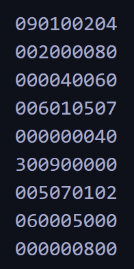

# Sudoku Solver

### Solves a 3x3-Sudoku by trial and error.

## How to use

Construct a new Field, give the path to the file which holds the field as the first argument. Then construct a new Solver object, give the new Field as the first argument and wait until a solution is printed.

```cpp
Field field("FILEPATH");
Solver solver(field);
```

## Format of the input file

e.g.



where numbers 1-9 are the number on the field and 0 are empty boxes.
